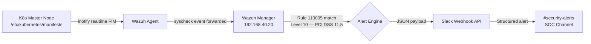

# homelab

**Cloud & DevOps Engineering — Private Infrastructure Portfolio**

> Architected and operated to a 99.9% production-grade SLA with strict change management and version-controlled IaC. Everything here is verified operational.

---

## Overview

This repository is the single source of truth for a self-hosted private cloud environment running on bare-metal Proxmox VE. The infrastructure mirrors enterprise production standards: HA Kubernetes control plane, GitOps-managed workloads, multi-tier SIEM/XDR security orchestration, VLAN-segmented networking, and full observability.

No configuration exists outside of version control. No manual changes are made to production without a documented change record.

---

## Architecture

### Hardware Inventory

| Node | Machine | CPU | RAM | Storage | IP |
|------|---------|-----|-----|---------|-----|
| enode-a | HP EliteDesk G6 Mini | Intel Core i5-10500T | 32GB DDR4 | 1TB NVMe | 192.168.40.10 |
| enode-b | HP EliteDesk G5 Mini | Intel Core i5-9500T | 16GB DDR4 | 1TB NVMe | 192.168.40.11 |
| enode-c | HP EliteDesk G5 Mini | Intel Core i5-9500T | 16GB DDR4 | 1TB NVMe | 192.168.40.12 |

**Networking:** TP-Link ER605 (L3 Router) + Netgear GS308E (Managed Switch, 802.1Q VLAN-aware)

---

### Network Architecture — VLAN Segmentation

| VLAN | Name | Subnet | Purpose |
|------|------|--------|---------|
| 10 | Management | 192.168.10.0/24 | Pi-hole DNS, out-of-band access |
| 20 | Lab | 192.168.20.0/24 | Kubernetes cluster nodes, MetalLB pool |
| 30 | IoT | 192.168.30.0/24 | Isolated IoT devices |
| 40 | Servers | 192.168.40.0/24 | Proxmox nodes, Wazuh, Grafana |

**MetalLB Pool:** `192.168.20.200 – 192.168.20.220`
**Pi-hole:** LXC 100 @ `192.168.10.2` — cross-VLAN DNS resolution for all segments

---

### Kubernetes HA Cluster

| Role | Hostname | IP | RAM | Host |
|------|----------|----|-----|------|
| Control Plane | k8s-master-1 | 192.168.20.10 | 4GB | enode-a |
| Control Plane | k8s-master-2 | 192.168.20.11 | 4GB | enode-b |
| Control Plane | k8s-master-3 | 192.168.20.12 | 4GB | enode-c |
| Worker | k8s-worker-1 | 192.168.20.20 | 8GB | enode-a |
| Worker | k8s-worker-2 | 192.168.20.21 | 8GB | enode-a |

**K8s Version:** v1.32.13 — **CNI:** Flannel (`10.244.0.0/16`) — **LB:** MetalLB

The 3-node control plane configuration ensures **etcd quorum** is maintained through single-node failure. With one master down, the remaining two nodes hold quorum (2/3) and the cluster continues scheduling workloads with zero interruption. Control plane VMs are distributed across all three physical hosts — no physical host is a single point of failure for the control plane.

---

### Infrastructure Services

| Service | Type | IP | Host |
|---------|------|----|------|
| ArgoCD | K8s LoadBalancer | 192.168.20.201 | Kubernetes |
| Grafana (kube-prometheus-stack) | K8s LoadBalancer | 192.168.20.200 | Kubernetes |
| Wazuh SIEM/XDR | LXC 102 | 192.168.40.20 | enode-a |
| Grafana/Prometheus (Proxmox) | LXC 101 | 192.168.40.100 | enode-a |
| Pi-hole DNS | LXC 100 | 192.168.10.2 | enode-a |

---

## Security Pipeline — Kubernetes Control Plane Sentinel

Real-time detection and automated alerting for Kubernetes control plane tampering. MTTD under 5 seconds from file change to Slack notification.



### Detection Logic

**Monitored Path:** `/etc/kubernetes/manifests` (realtime, check_all) on all 3 masters

**Custom Rule 110005** — `local_rules.xml`:
```xml
<group name="syscheck,k8s_security,">
  <rule id="110005" level="10">
    <if_sid>550</if_sid>
    <field name="file">/etc/kubernetes/manifests</field>
    <description>CRITICAL: K8s Manifest Tampering Detected on $(agent.name)</description>
    <group>syscheck,k8s_security,pci_dss_11.5,gpg13_4.11,</group>
  </rule>
</group>
```

**Compliance Tags:** PCI DSS 11.5 (unauthorized file modification) · GPG13 4.11 (change detection)

**Threat Coverage:**
- Supply chain attacks via control plane manifest injection
- Privilege escalation through kube-apiserver flag modification
- Audit log suppression via manifest tampering
- Unauthorized admission controller insertion

**Secrets Management:** Slack webhook URL stored in Ansible Vault — never in plaintext, never committed to version control.

---

## GitOps Pipeline — ArgoCD

All cluster state is version-controlled in this repository. No manual `kubectl apply` in production.

```
github.com/brypreez/homelab
└── kubernetes/
    └── apps/
        └── app-of-apps.yaml   ← ArgoCD root application
```

**ArgoCD Configuration:**
- Automated sync enabled
- Self-healing enabled (divergence triggers re-sync)
- Pruning enabled (resources removed from Git are removed from cluster)
- SSH deploy key authentication — no PAT stored in cluster

Any drift between cluster state and Git is automatically corrected. Change management happens in Git, not in the cluster.

---

## Observability

### Two-Tier Monitoring Stack

**Tier 1 — Proxmox Host Metrics** (LXC 101 @ `192.168.40.100`)
- Prometheus scraping Node Exporter on all three physical hosts
- Grafana dashboards for CPU, RAM, NVMe I/O, and network throughput per physical node

**Tier 2 — Kubernetes Cluster Metrics** (MetalLB @ `192.168.20.200`)
- kube-prometheus-stack (28 pre-built dashboards)
- etcd health and quorum monitoring
- Pod networking and CNI visibility
- Control plane component metrics (API server, scheduler, controller-manager)
- Alertmanager with Slack integration for threshold breaches

---

## Infrastructure as Code

### Ansible

Runs from `enode-a` at `~/ansible/`.

```
ansible/
├── inventory/
│   └── hosts.ini          # 9 hosts across 4 groups
└── playbooks/
    └── wazuh_self_healing.yml   # Idempotent config enforcement
```

**Host Groups:** `wazuh_manager` · `proxmox_nodes` · `k8s_control_plane` · `k8s_workers` · `all_agents`

The `wazuh_self_healing.yml` playbook enforces correct Wazuh configuration state across all 8 agents. Verified idempotent — `changed=0` on a correctly configured fleet.

### Terraform

Provider: `bpg/proxmox` v0.98.0 (replaces `telmate/proxmox` — eliminated hardcoded `VM.Monitor` permission bug)

```
terraform/proxmox/
├── provider.tf
├── variables.tf
├── main.tf
├── outputs.tf
├── terraform.tfvars.example
└── .gitignore              # terraform.tfvars excluded — contains vault secrets
```

**Validated Plan:** `Plan: 2 to add, 0 to change, 0 to destroy`

Provisions `k8s-worker-3` (VMID 205, enode-b, `192.168.20.22`) and `k8s-worker-4` (VMID 206, enode-c, `192.168.20.23`) — each 4 cores, 8GB RAM, 50GB, cloud-init static VLAN networking, SSH key injection.

---

## Featured Technical Postmortem

### RFC 6724 — IPv4/IPv6 Address Selection Conflict

**Symptom:** Wazuh Dashboard could not connect to OpenSearch Indexer. `ERR_CONNECTION_REFUSED` on all dashboard attempts. Both services confirmed running.

**Investigation:**

```bash
# Both services running — not a process issue
systemctl status wazuh-indexer wazuh-dashboard

# Indexer binding confirmed IPv4 only
ss -tlnp | grep 9200
# → 0.0.0.0:9200

# Dashboard attempting IPv6
cat /etc/wazuh-dashboard/opensearch_dashboards.yml
# opensearch.hosts: ["https://localhost:9200"]
```

**Root Cause:** RFC 6724 defines IPv6 address selection preference rules. When `localhost` is resolved, the system prefers `::1` (IPv6 loopback) over `127.0.0.1` (IPv4 loopback) per the RFC 6724 precedence table. The Wazuh Indexer was bound exclusively to `127.0.0.1`. The Dashboard resolved `localhost` → `::1` → connection refused.

**Fix:**

```yaml
# /etc/wazuh-dashboard/opensearch_dashboards.yml
opensearch.hosts: ["https://127.0.0.1:9200"]
opensearch.ssl.verificationMode: none
```

**Result:** 100% data ingestion restored. All 8 agents reporting.

**Lesson:** Never use `localhost` in service configuration files on dual-stack systems. Always specify the explicit address family.

---

### XML Line 0 Parser Error — Wazuh Manager Silent Failure

**Symptom:** Wazuh Manager started without error but produced zero alerts. All 8 agents connected but no events processed.

**Diagnosis:**

```bash
xmllint --noout /var/ossec/etc/ossec.conf
# → ossec.conf:1: parser error: Extra content at the end of the document

/var/ossec/bin/wazuh-analysisd -t
# → ERROR: Configuration error at ossec.conf
```

**Root Cause:** Two issues identified:
1. Nested `<ossec_config>` root containers — the file had been edited with a duplicate root tag wrapping a section
2. Unclosed `<ruleset>` tag at line 260 — blocked the parser from reading any rules downstream

**Fix:** Removed duplicate root container, closed `<ruleset>` tag, re-validated with `xmllint --noout` until clean.

**Result:** Manager restarted cleanly, Rule 110005 loaded, FIM alerts flowing.

---

## Infrastructure Lifecycle & Engineering Roadmap

### Phase 1 — Complete ✅

| Component | Status |
|-----------|--------|
| 3-node Proxmox VE cluster (corosync HA) | ✅ Operational |
| 5-node Kubernetes HA cluster (kubeadm) | ✅ Operational |
| VLAN-segmented network (4 zones, 802.1Q) | ✅ Operational |
| Wazuh SIEM/XDR — 8 agents | ✅ Operational |
| K8s Control Plane Sentinel (FIM + Slack) | ✅ Operational |
| ArgoCD GitOps pipeline | ✅ Operational |
| Two-tier observability (Prometheus/Grafana) | ✅ Operational |
| Ansible IaC — idempotent config enforcement | ✅ Validated |
| Terraform IaC — Proxmox VM provisioning | ✅ Plan validated |
| GitHub Actions CI/CD (ansible-lint, tf-validate) | ✅ Operational |

### Active Engineering Sprints — Q1/Q2 2026

| Sprint | Objective | Priority |
|--------|-----------|----------|
| Terraform Apply | Provision k8s-worker-3/4 after enode-b/c RAM upgrade | High |
| K8s Audit Logging → Wazuh | Route kube-apiserver audit events into SIEM pipeline | High |
| Ingress + cert-manager | nginx Ingress controller + automated TLS via Let's Encrypt | Medium |
| Vaultwarden | Self-hosted password manager deployment via ArgoCD | Medium |
| Automated Wazuh Remediation | Active-response scripts for Rule 110005 trigger | High |

### Phase 3 — Backlog

- Multi-cluster federation (k3s lightweight edge cluster)
- OPA/Gatekeeper policy enforcement
- Velero backup and disaster recovery testing
- Service mesh (Istio or Linkerd) for mTLS between workloads
- SIEM correlation rules: cross-agent lateral movement detection

---

## Repository Structure

```
homelab/
├── README.md
├── docs/
│   ├── network-setup.md
│   ├── kubernetes-setup.md
│   ├── monitoring-setup.md
│   ├── wazuh-setup.md
│   └── troubleshooting.md
├── kubernetes/
│   └── apps/
│       └── nginx-test.yaml
├── ansible/
│   ├── inventory/
│   │   └── hosts.ini
│   └── playbooks/
│       └── wazuh_self_healing.yml
└── terraform/
    └── proxmox/
        ├── provider.tf
        ├── variables.tf
        ├── main.tf
        ├── outputs.tf
        └── terraform.tfvars.example
```

---

## Stack

| Layer | Technology |
|-------|-----------|
| Hypervisor | Proxmox VE 8.x |
| Container Orchestration | Kubernetes v1.32 (kubeadm) |
| CNI | Flannel |
| Load Balancer | MetalLB |
| GitOps | ArgoCD |
| SIEM/XDR | Wazuh 4.14.3 |
| IaC — Provisioning | Terraform (bpg/proxmox) |
| IaC — Configuration | Ansible |
| CI/CD | GitHub Actions |
| Observability | kube-prometheus-stack, Grafana, Loki, Alertmanager |
| DNS | Pi-hole |
| Networking | TP-Link ER605, Netgear GS308E (802.1Q) |

---

*Operated to production standards. Everything here is verified operational.*
