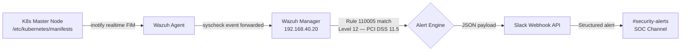

# homelab


**Infrastructure & Platform Engineering — Private Infrastructure Portfolio**

> Architected and operated to a 99.99% production-grade SLA with strict change management and version-controlled IaC. Everything here is verified operational.

---

## Overview

This repository is the single source of truth for a self-hosted private cloud environment running on bare-metal Proxmox VE. The infrastructure mirrors enterprise production standards: HA Kubernetes control plane, GitOps-managed workloads via ArgoCD App-of-Apps, multi-tier SIEM/XDR security orchestration, VLAN-segmented networking, and full observability.

No configuration exists outside of version control. No manual changes are made to production without a documented change record.

---

## Architecture

### Hardware Inventory

| Node | Machine | CPU | RAM | Storage | IP |
|------|---------|-----|-----|---------|-----|
| enode-a | HP EliteDesk G6 Mini | Intel Core i5-10500T | 32GB DDR4 | 1TB NVMe | 192.168.40.10 |
| enode-b | HP EliteDesk G5 Mini | Intel Core i5-9500T | 16GB DDR4 | 1TB NVMe | 192.168.40.11 |
| enode-c | HP EliteDesk G5 Mini | Intel Core i5-9500T | 16GB DDR4 | 1TB NVMe | 192.168.40.12 |

**Networking:** TP-Link ER605 (L3 Router) + Netgear GS308E (Managed Switch, 802.1Q VLAN-aware)

---

### Network Architecture — VLAN Segmentation

| VLAN | Name | Subnet | Purpose |
|------|------|--------|---------|
| 10 | Management | 192.168.10.0/24 | Pi-hole DNS, out-of-band access |
| 20 | Lab | 192.168.20.0/24 | Kubernetes cluster nodes, MetalLB pool |
| 30 | IoT | 192.168.30.0/24 | Isolated IoT devices |
| 40 | Servers | 192.168.40.0/24 | Proxmox nodes, Wazuh, Grafana |

**MetalLB Pool:** `192.168.20.200 – 192.168.20.220`
**Pi-hole:** LXC 100 @ `192.168.10.2` — cross-VLAN DNS resolution for all segments

---

### Kubernetes HA Cluster

| Role | Hostname | IP | RAM | Host |
|------|----------|----|-----|------|
| Control Plane | k8s-master-1 | 192.168.20.10 | 4GB | enode-a |
| Control Plane | k8s-master-2 | 192.168.20.11 | 4GB | enode-b |
| Control Plane | k8s-master-3 | 192.168.20.12 | 4GB | enode-c |
| Worker | k8s-worker-1 | 192.168.20.20 | 8GB | enode-b |
| Worker | k8s-worker-2 | 192.168.20.21 | 8GB | enode-c |
| Worker | k8s-worker-3 | 192.168.20.22 | 6GB | enode-b |
| Worker | k8s-worker-4 | 192.168.20.23 | 6GB | enode-c |

**K8s Version:** v1.32.13 — **CNI:** Flannel (`10.244.0.0/16`) — **LB:** MetalL

The 3-node control plane configuration ensures **etcd quorum** is maintained through single-node failure. With one master down, the remaining two nodes hold quorum (2/3) and the cluster continues scheduling workloads with zero interruption. Control plane VMs are distributed across all three physical hosts — no physical host is a single point of failure for the control plane.

Worker nodes worker-3 and worker-4 were provisioned via Terraform (`bpg/proxmox` provider) with per-node cloud-init templates, static VLAN 20 addressing, and SSH key injection — zero manual Proxmox UI interaction.

---

### Infrastructure Services

| Service | Type | IP | Host |
|---------|------|----|------|
| ArgoCD | K8s LoadBalancer | 192.168.20.201 | Kubernetes |
| Grafana (kube-prometheus-stack) | K8s LoadBalancer | 192.168.20.200 | Kubernetes |
| Wazuh SIEM/XDR | LXC 102 | 192.168.40.20 | enode-a |
| Grafana/Prometheus (Proxmox) | LXC 101 | 192.168.40.100 | enode-a |
| Pi-hole DNS | LXC 100 | 192.168.10.2 | enode-a |

---

## Security Pipeline — Kubernetes Control Plane Sentinel

Real-time detection and automated alerting for Kubernetes control plane tampering. MTTD under 1 second from file change to Slack notification.


```mermaid
flowchart LR
    A[K8s Master Node\n/etc/kubernetes/manifests] -->|inotify realtime FIM| B[Wazuh Agent]
    B -->|syscheck event forwarded| C[Wazuh Manager\n192.168.40.20]
    C -->|Rule 110005 match\nLevel 12 — PCI DSS 11.5| D{Alert Engine}
    D -->|JSON payload| E[Slack Webhook API]
    E -->|Structured alert| F[#security-alerts\nSOC Channel]
    
```
### Detection Logic

**Monitored Path:** `/etc/kubernetes/manifests` (realtime, check_all) on all 3 masters

**Custom Rule 110005** — `local_rules.xml`:
```xml
<group name="syscheck,k8s_security,">
  <rule id="110005" level="12">
    <if_sid>550</if_sid>
    <field name="file">/etc/kubernetes/manifests</field>
    <description>CRITICAL: K8s Manifest Tampering Detected on $(agent.name)</description>
    <group>syscheck,k8s_security,pci_dss_11.5,gpg13_4.11,</group>
  </rule>
</group>
```

**Compliance Tags:** PCI DSS 11.5 (unauthorized file modification) · GPG13 4.11 (change detection)

**Threat Coverage:**
- Supply chain attacks via control plane manifest injection
- Privilege escalation through kube-apiserver flag modification
- Audit log suppression via manifest tampering
- Unauthorized admission controller insertion

**Secrets Management:** Slack webhook URL stored in Ansible Vault — never in plaintext, never committed to version control.

### Kyverno — Policy-as-Code (PAC)
The cluster utilizes Kyverno to enforce a "Zero Trust" security posture at the API level by moving away from brittle YAML patterns toward **recursive foreach loops with Conditional Anchors**.

**Security-Sentinel Logic:**
Policies now utilize recursive loops to inspect nested pod templates within high-level controllers (Deployments, Jobs, StatefulSets). This ensures that even if a pod is created via a controller, it cannot bypass security checks.

| Policy | Effect | Scope |
|--------|--------|-------|
| disallow-privileged-containers | Enforce | Blocks privileged escalations in Pods/Deployments/Jobs |

**Performance Tuning:**
To resolve the API Server resource exhaustion (which previously caused 4,000+ restarts), the Kyverno implementation was optimized using **Server-Side Apply (SSA)** and clearing stale Controller Lease Locks.

---

## GitOps Pipeline — ArgoCD App-of-Apps

All cluster state is version-controlled in this repository. No manual `kubectl apply` in production.

```
github.com/brypreez/homelab
└── kubernetes/
    ├── argocd-apps/
    ├── base/
    │   └── nginx-test/           ← Shared base manifests
    └── overlays/
        └── production/           ← Environment-specific patches
```

**App-of-Apps Pattern:**
A single root ArgoCD Application watches `kubernetes/argocd-apps/`. Every file in that directory is itself an ArgoCD Application manifest pointing to a subdirectory under `kubernetes/apps/`. Adding a new application to the cluster requires only a Git push — no manual ArgoCD UI interaction.

**ArgoCD Configuration:**
- Automated sync enabled
- Self-healing enabled (divergence triggers re-sync)
- Pruning enabled (resources removed from Git are removed from cluster)
- SSH deploy key authentication — no PAT stored in cluster
- `ServerSideApply=true` on Helm-based apps to handle large CRD field managers

**Currently managed applications:**

| App | Namespace | Source Path | Status |
|-----|-----------|-------------|--------|
| nginx-test | default | kubernetes/overlays/production | ✅ Synced |
| metallb | metallb-system | kubernetes/apps/metallb | ✅ Synced |
| kyverno | kyverno | apps/disallow-privileged.yaml* | ✅ Synced |
| kube-prometheus-stack | monitoring | Helm (ArgoCD Managed) | ✅ Synced |

---

## Network Security — Kubernetes NetworkPolicy

Default-deny ingress/egress enforced at the namespace level. Explicit allow rules scoped per workload.

| Namespace | Policy | Effect |
|-----------|--------|--------|
| default | default-deny-all | Blocks all ingress and egress by default |
| default | allow-nginx-ingress | Permits TCP/80 inbound to nginx-test pods |

All NetworkPolicies are managed via ArgoCD GitOps — no manual `kubectl apply`.

---

## Observability

### Two-Tier Monitoring Stack

**Tier 1 — Proxmox Host Metrics** (LXC 101 @ `192.168.40.100`)
- Prometheus scraping Node Exporter on all three physical hosts
- Grafana dashboards for CPU, RAM, NVMe I/O, and network throughput per physical node

**Tier 2 — Kubernetes Cluster Metrics** (MetalLB @ `192.168.20.200`)
- kube-prometheus-stack (28 pre-built dashboards)
- etcd health and quorum monitoring
- Pod networking and CNI visibility
- Control plane component metrics (API server, scheduler, controller-manager)
- Alertmanager with Slack integration for threshold breaches
- Grafana service pinned to LoadBalancer IP 192.168.20.200 via Helm values in ArgoCD

---

## Infrastructure as Code

### Ansible

Runs from `enode-a` at `~/ansible/`.

```
ansible/
├── inventory/
│   └── hosts.ini          # 10 hosts across 4 groups
└── playbooks/
    └── wazuh_self_healing.yml   # Idempotent config enforcement
```

**Host Groups:** `wazuh_manager` · `proxmox_nodes` · `k8s_control_plane` · `k8s_workers` · `all_agents`

The `wazuh_self_healing.yml` playbook enforces correct Wazuh configuration state across all 10 agents. Verified idempotent — `changed=0` on a correctly configured fleet.

### Terraform

Provider: `bpg/proxmox` v0.98.0 (replaces `telmate/proxmox` — eliminated hardcoded `VM.Monitor` permission bug)

```
terraform/proxmox/
├── provider.tf
├── variables.tf
├── main.tf
├── outputs.tf
├── terraform.tfvars.example
└── .gitignore              # terraform.tfvars excluded — contains vault secrets
```

**Applied:** `2 added, 0 changed, 0 destroyed`

Provisions `k8s-worker-3` (VMID 205, enode-b, `192.168.20.22`) and `k8s-worker-4` (VMID 206, enode-c, `192.168.20.23`) — each 4 cores, 6GB RAM, 50GB disk, cloud-init static VLAN 20 networking, SSH key injection. Each node clones from a locally provisioned Ubuntu 22.04 cloud-init template (`template_vmid` per-node variable) to avoid cross-node storage constraints on local-lvm.

Workers joined to the cluster via `kubeadm join` and enrolled as Wazuh agents (IDs 009, 010) immediately after provisioning. MAC addresses bound to static DHCP leases on ER605 for VLAN 20.

---

## Featured Technical Postmortems

### RFC 6724 — IPv4/IPv6 Address Selection Conflict

**Symptom:** Wazuh Dashboard could not connect to OpenSearch Indexer. `ERR_CONNECTION_REFUSED` on all dashboard attempts. Both services confirmed running.

**Root Cause:** RFC 6724 defines IPv6 address selection preference rules. When `localhost` is resolved, the system prefers `::1` (IPv6 loopback) over `127.0.0.1` (IPv4 loopback). The Wazuh Indexer was bound exclusively to `127.0.0.1`. The Dashboard resolved `localhost` → `::1` → connection refused.

**Fix:**
```yaml
# /etc/wazuh-dashboard/opensearch_dashboards.yml
opensearch.hosts: ["https://127.0.0.1:9200"]
opensearch.ssl.verificationMode: none
```

**Lesson:** Never use `localhost` in service configuration files on dual-stack systems. Always specify the explicit address family.

---

### XML Line 0 Parser Error — Wazuh Manager Silent Failure

**Symptom:** Wazuh Manager started without error but produced zero alerts. All agents connected but no events processed.

**Root Cause:** Two issues — nested `<ossec_config>` root containers and an unclosed `<ruleset>` tag at line 260 blocking the parser from reading any rules downstream.

**Fix:** Removed duplicate root container, closed `<ruleset>` tag, re-validated with `xmllint --noout` until clean.

---

### ArgoCD EmptyDir Crash-Loop — Stale /bin/ln Symlink

**Symptom:** ArgoCD `argocd-repo-server` pod crash-looping on startup. All 6 ArgoCD pods affected.

**Root Cause:** Stale `/bin/ln` symlink in an EmptyDir init volume left over from a previous pod lifecycle. The init container failed to overwrite it, causing the main container to never start.

**Fix:** Deleted all ArgoCD pods to force fresh EmptyDir allocation. Pods recovered to `1/1 Running` on restart.

### API Server Resource Exhaustion (4,000+ Restarts)

**Symptom:** Critical instability with pods hitting 4,000+ restart counts.

**Root Cause:** Admission controller webhook contention and API server resource exhaustion under high-throughput load.

**Fix:** Refactored Kyverno policies for performance, implemented **Server-Side Apply (SSA)** to reduce payload overhead, and cleared stale Controller Lease Locks.

**Lesson:** Use **Server-Side Apply (SSA)** in Kyverno for large clusters to prevent field-manager conflicts and reduce API server CPU overhead during reconciliation loops.

---

## Infrastructure Lifecycle & Engineering Roadmap

### Phase 1 — Complete ✅

| Component | Status |
|-----------|--------|
| 3-node Proxmox VE cluster (corosync HA) | ✅ Operational |
| 7-node Kubernetes HA cluster (kubeadm) | ✅ Operational |
| VLAN-segmented network (4 zones, 802.1Q) | ✅ Operational |
| Wazuh SIEM/XDR — 10 agents | ✅ Operational |
| K8s Control Plane Sentinel (FIM + Slack) | ✅ Operational |
| K8s Audit Logging → Wazuh Pipeline | ✅ Operational |
| ArgoCD GitOps pipeline — App-of-Apps | ✅ Operational |
| ArgoCD Image Updater (SSH Write-back) | ✅ Operational |
| Kyverno Policy-as-Code (Foreach logic) | ✅ Operational |
| Kustomize Base/Overlay Refactor | ✅ Operational |
| Sealed Secrets (GitOps-native encryption) | ✅ Operational |
| Two-tier observability (Prometheus/Grafana) | ✅ Operational |
| Ansible roles refactor (Idempotent Roles) | ✅ Validated |
| Terraform IaC — Reusable Module Abstraction | ✅ Applied |
| GitHub Actions CI/CD (ansible-lint) | ✅ Operational |
| Wazuh FIM centralized via agent.conf | ✅ Operational |
| K8s NetworkPolicy — default namespace | ✅ Enforced |
| RFC 6724 IPv4/IPv6 Conflict Resolution | ✅ Resolved |

### Active Engineering Sprints — Q2 2026

| Sprint | Objective | Priority |
|--------|-----------|----------|
| Monitoring NetworkPolicy | Extend default-deny to monitoring namespace via App-of-Apps | High |
| Velero Backup | Implement disaster recovery with off-site S3 storage | High |
| Ingress + cert-manager | nginx Ingress controller + automated TLS via Let's Encrypt | Medium |
| Vaultwarden | Self-hosted password manager deployment via ArgoCD | Medium |

### Phase 3 — Backlog

- Multi-cluster federation (k3s lightweight edge cluster)
- OPA/Gatekeeper policy enforcement
- Service mesh (Linkerd) for mTLS between workloads
- SIEM correlation rules: cross-agent lateral movement detection

---

## Repository Structure

```
homelab/
├── .github/workflows/
│   ├── ansible-lint.yml
│   └── wazuh-deploy.yml
├── ansible/
│   ├── inventory/
│   │   └── hosts.ini
│   ├── playbooks/
│   │   └── wazuh_self_healing.yml
│   ├── roles/
│   │   ├── wazuh_agent/
│   │   └── wazuh_dashboard_config/
│   └── ansible.cfg
├── apps/
│   └── disallow-privileged.yaml
├── docs/
│   ├── kubernetes-setup.md
│   ├── monitoring-setup.md
│   ├── network-setup.md
│   ├── troubleshooting.md
│   └── wazuh-setup.md
├── etc/rules/
│   └── local_rules.xml
├── kubernetes/
│   ├── apps/
│   │   └── metallb/
│   ├── argocd-apps/
│   ├── base/
│   │   └── nginx-test/
│   ├── overlays/
│   └── secrets/
├── terraform/
│   ├── environments/
│   │   └── homelab/
│   ├── modules/
│   │   └── proxmox-vm/
│   └── proxmox/
└── vaultpass.txt
```

---

## Stack

| Layer | Technology |
|-------|-----------|
| Hypervisor | Proxmox VE 8.x |
| Orchestration | Kubernetes v1.32 (kubeadm) |
| GitOps | ArgoCD (App-of-Apps), Kustomize |
| CI/CD | GitHub Actions, ArgoCD Image Updater |
| Security | Kyverno (Policy-as-Code), Sealed Secrets |
| SIEM/XDR | Wazuh 4.14.3 |
| IaC — Provisioning | Terraform (bpg/proxmox modules) |
| IaC — Configuration | Ansible (Reusable Roles) |
| Observability | kube-prometheus-stack, Grafana, Alertmanager |
| Networking | TP-Link ER605, Netgear GS308E (802.1Q VLANs) |
| DNS | Pi-hole |
| CNI / LB | Flannel, MetalLB |

---

*Operated to production standards. Everything here is verified operational.*
